

  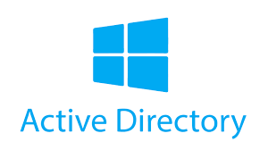

# ACTIVE-DIRECTORY-LAB: Infrastructure Setup Walkthrough

**Phase 1 of the Active Directory Lab**

This phase covers the infrastructure groundwork for the lab: standing up a domain controller and a client VM in Azure, giving the domain controller a fixed private IP, and pointing the client at that IP for DNS so it can locate and eventually join the domain. Everything here happens before Active Directory Domain Services is even installed. It is the network foundation the rest of the lab depends on.

---

## Why This Phase Exists

A domain join is not just an account being added to a directory. It is a client asking a specific question over the network: where is the domain controller for this domain, and how do I reach it. That question gets answered through DNS, not through the domain join wizard itself. If the client cannot resolve that question correctly, the join fails before it ever gets to authentication.

This phase exists to make sure the plumbing behind that question is in place first. Two virtual machines get created, one to act as the domain controller and one to act as a client, both placed on the same virtual network so they can reach each other. The domain controller gets a static private IP so it has a fixed, predictable address. The client then gets pointed at that address for DNS instead of the default Azure-provided DNS. By the end of this phase, the client can find the domain controller by name resolution alone, which is the actual prerequisite for a domain join, not a side detail.

---

## Environment

| Component | Detail |
|---|---|
| Platform | Microsoft Azure |
| Resource group | Active-Directory-Lab |
| Region | East US 2 |
| Virtual network | vnet-eastus2-1 |
| Subnet | snet-eastus2-1 (172.16.0.0/24) |
| Domain controller VM | DC1, Windows Server 2022 Datacenter, Standard_D2ls_v7 |
| Client VM | client1, Windows 11 Pro, Standard_D2ls_v7 |
| DC1 private IP | 172.16.0.4 (static) |
| client1 private IP | 172.16.0.5 |

---

## What Got Configured

### 1. Resource Group

**Path:** Azure Portal > Resource groups > Create

A single resource group, Active-Directory-Lab, was created in East US 2 to hold every resource in this lab. Both VMs, the virtual network, and their supporting resources (NICs, public IPs, NSGs) all live inside it.

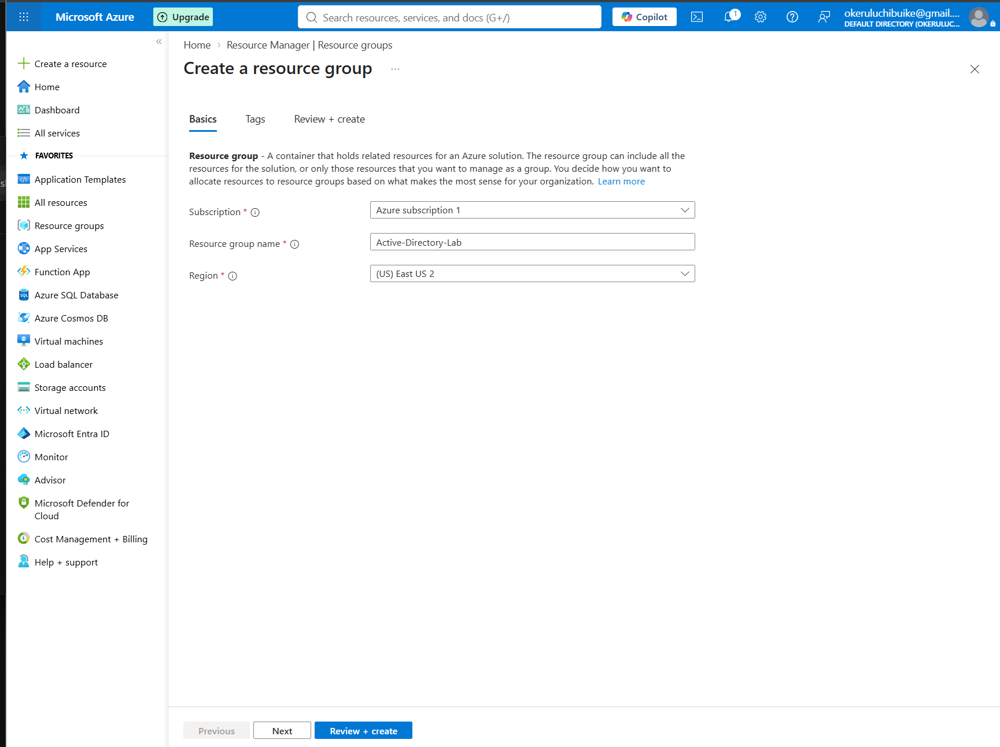

**Why one resource group for everything:** grouping every piece of this lab under a single resource group keeps the whole environment disposable as a unit. When the lab is finished, the entire thing, VMs, networking, disks, and all, can be torn down by deleting one resource group instead of hunting down each piece individually. It also keeps cost tracking and access scoped cleanly to just this lab, with nothing bleeding into other Azure resources on the same subscription.

### 2. Domain Controller VM (DC1)

**Path:** Azure Portal > Virtual machines > Create

DC1 was created inside the Active-Directory-Lab resource group, in East US 2, using the Windows Server 2022 Datacenter image on a Standard_D2ls_v7 size (2 vCPUs). RDP was left open on port 3389 for lab access.

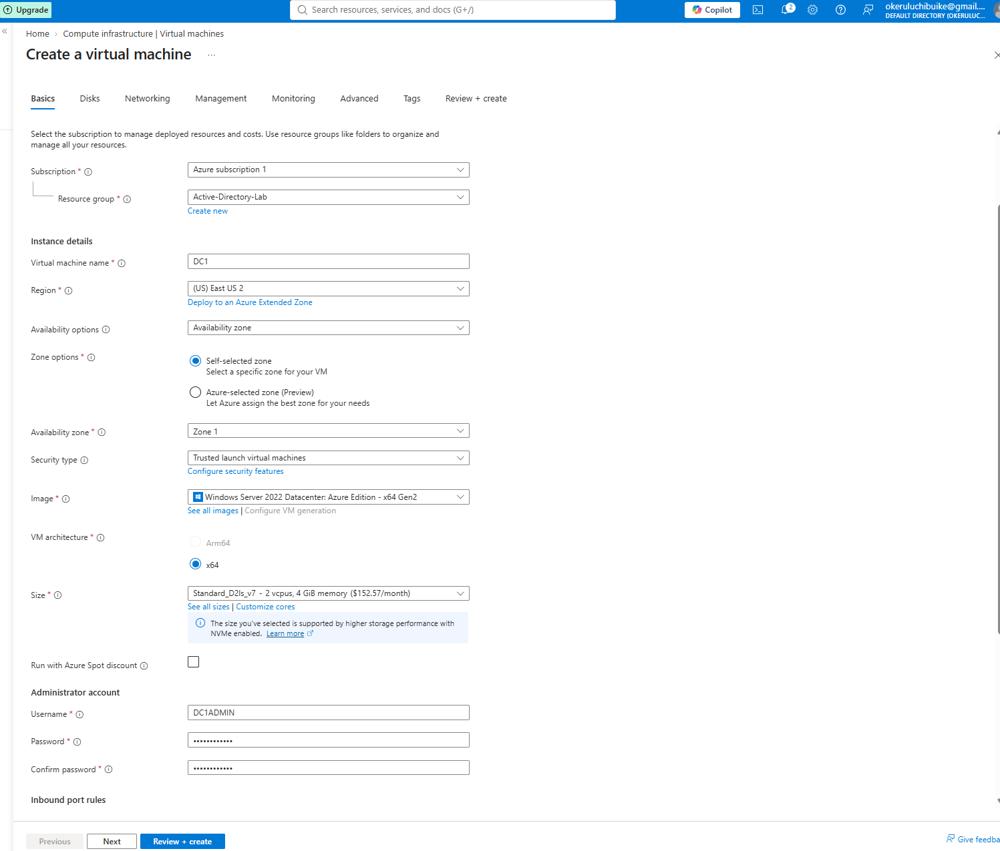

On the Networking tab, DC1 was placed on vnet-eastus2-1 and its default subnet, with a new public IP (DC1-ip) attached for remote access.

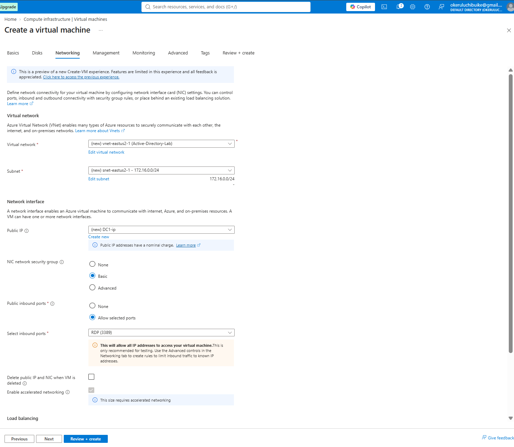

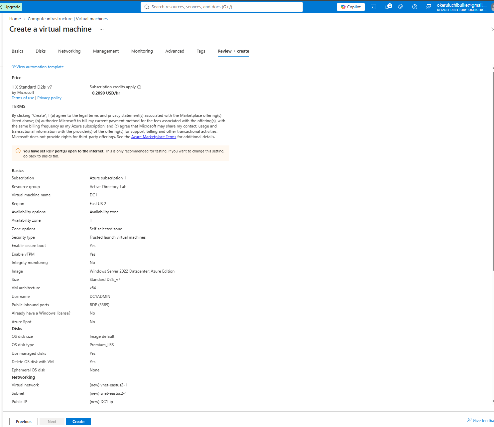

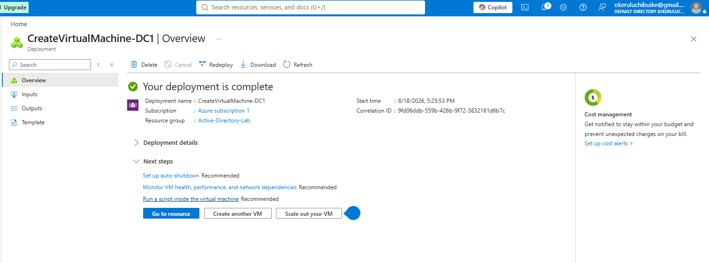

**Why DC1 gets built before client1:** the client's DNS setting in the next steps depends on knowing DC1's private IP, so DC1 has to exist first. Building the domain controller first also mirrors how a real environment gets stood up. The infrastructure that other machines depend on comes online before anything that depends on it.

### 3. Client VM (client1)

**Path:** Azure Portal > Virtual machines > Create

client1 was created in the same resource group and region as DC1, using the Windows 11 Pro image on the same Standard_D2ls_v7 size.

client1 was placed on the same virtual network and subnet as DC1, vnet-eastus2-1 and snet-eastus2-1, which is what allows the two machines to communicate at all.

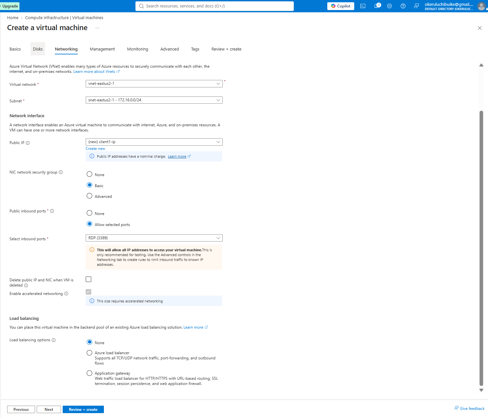

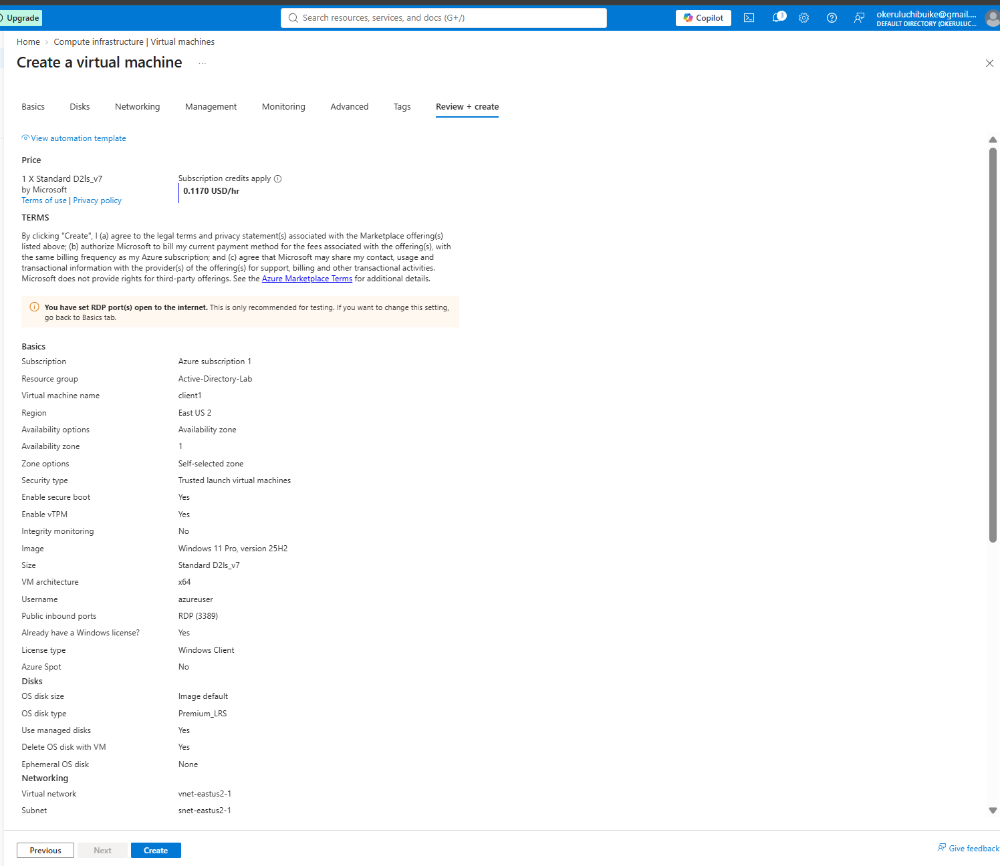

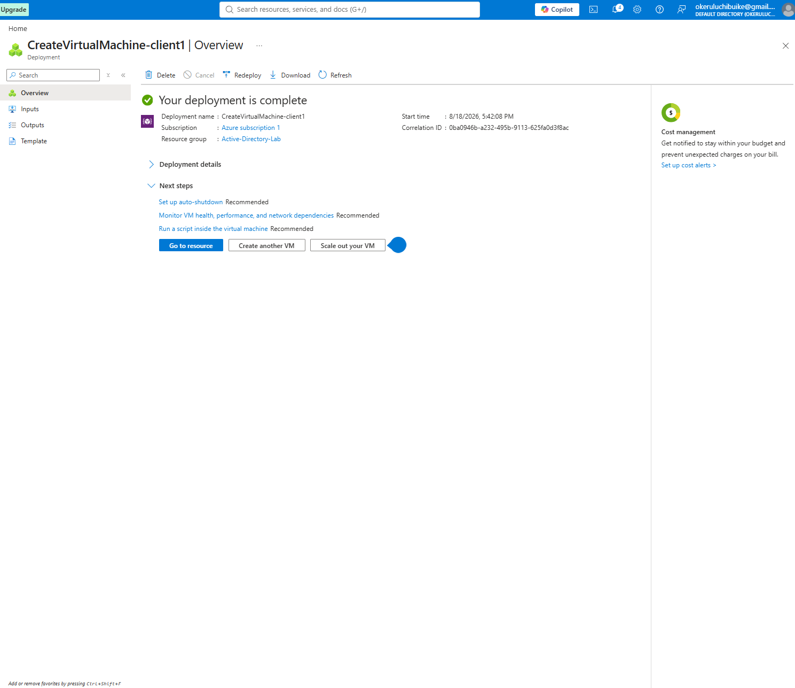

**Why client1 has to share DC1's virtual network:** Azure virtual networks are isolated from each other by default. Two VMs on separate vnets cannot reach one another's private IPs without additional configuration like peering. Putting client1 on the exact same vnet and subnet as DC1 means the two machines can already reach each other over the private network the moment they exist, which is a requirement for the DNS lookups and the domain join traffic that come later.

### 4. Static Private IP for DC1

**Path:** DC1 > Networking > Network settings > NIC > IP configurations

Before touching DNS, DC1's own network interface was reviewed to confirm its assigned private IP.

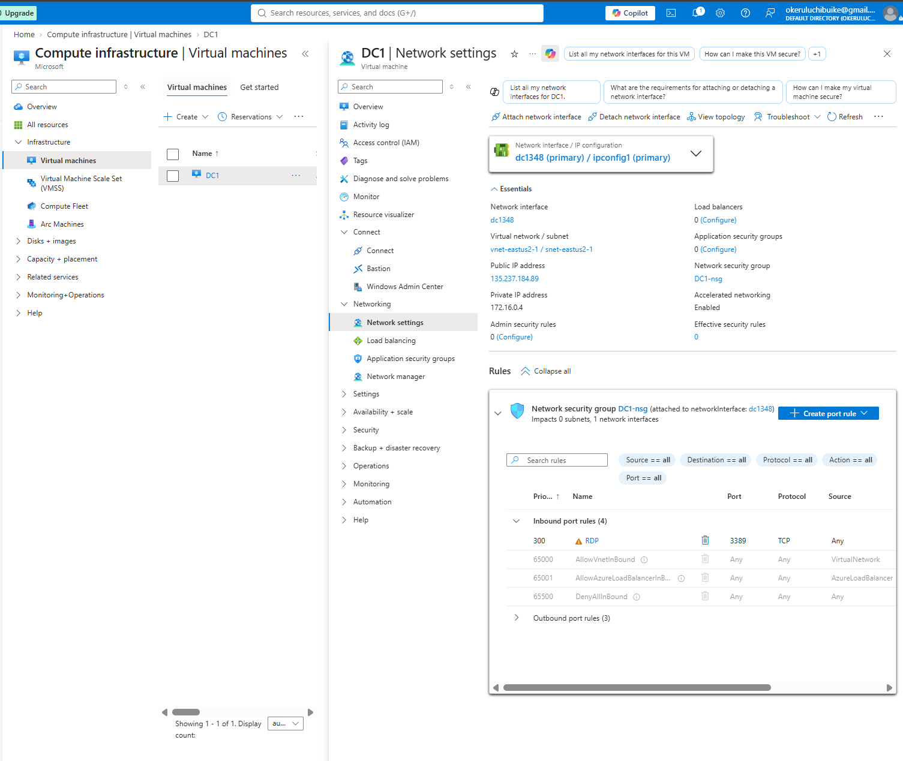

The IP configurations page showed the private IP allocated dynamically at 172.16.0.4.

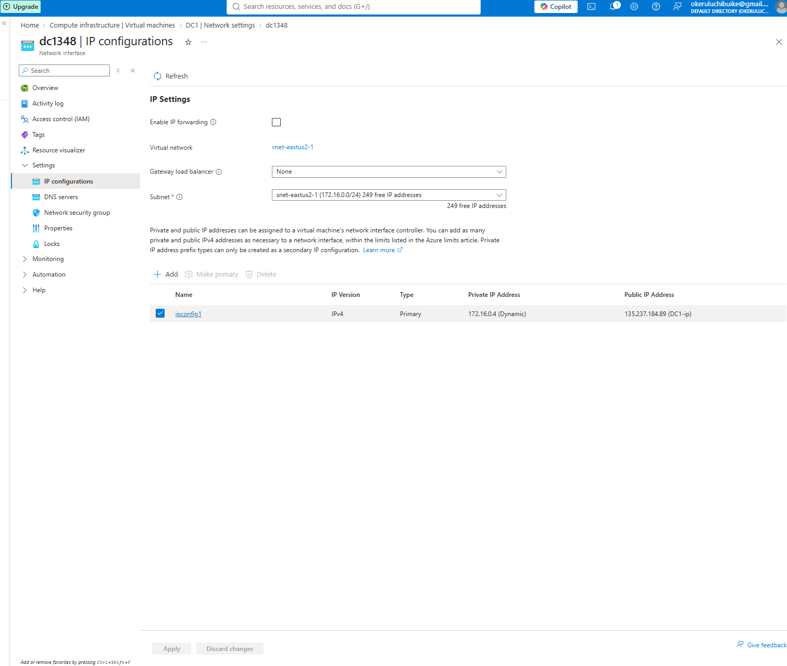

That allocation was then switched from Dynamic to Static, keeping the same address, 172.16.0.4, so it locks in place going forward.

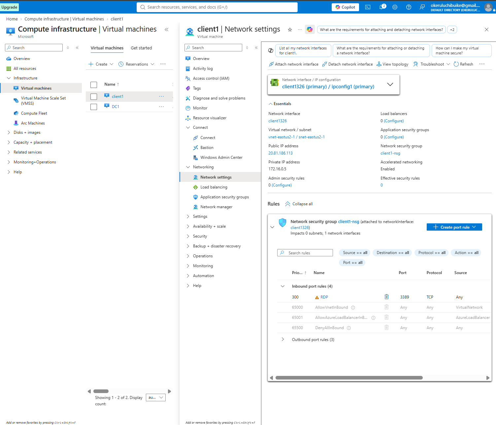

**Why this had to happen before configuring client1's DNS:** a dynamic private IP in Azure can change if the VM is stopped and reallocated, or under other conditions tied to the platform. The very next step is telling client1 to send every DNS query to this exact address. If that address quietly changed later, client1 would start sending DNS queries into the void and would eventually stop being able to resolve anything tied to the domain, including the domain controller itself. Locking the IP down first removes that failure mode before it can ever happen, rather than discovering it later as a mysterious outage.

### 5. DNS Configuration on client1

**Path:** client1 > Networking > Network settings > NIC > DNS servers

client1's own network interface was reviewed first to confirm its private IP and current settings.

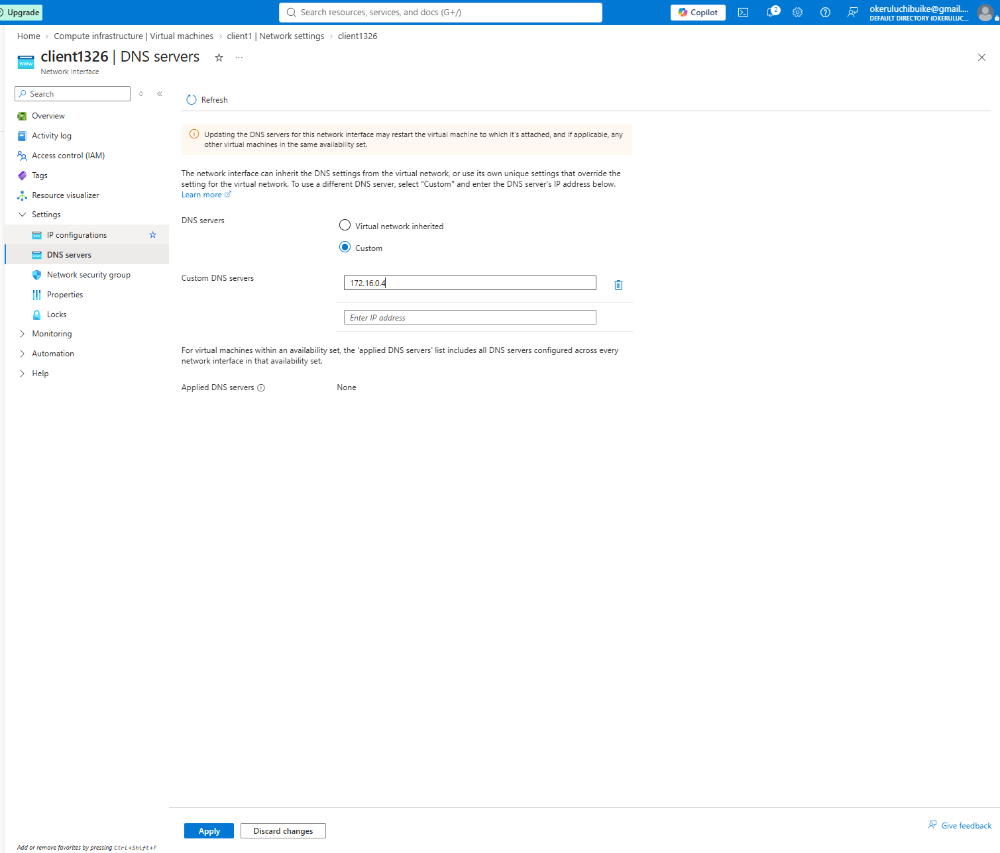

The DNS servers setting was then switched from "Virtual network inherited" to Custom, with DC1's static private IP, 172.16.0.4, entered as the DNS server client1 should use.

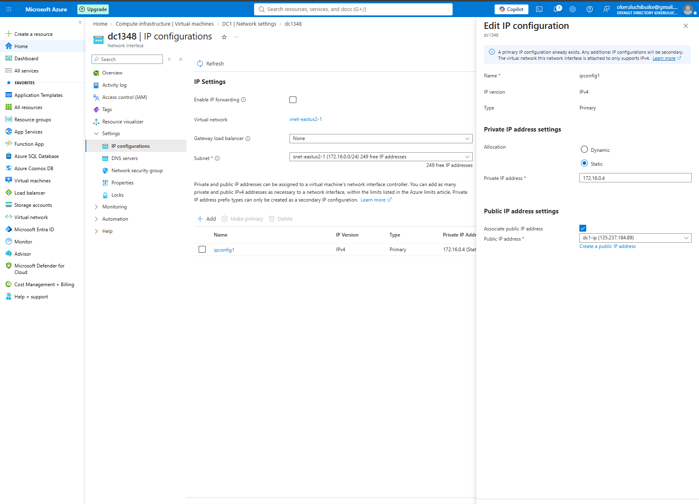

**Why the client has to point at the domain controller for DNS, in detail:** by default, an Azure VM's DNS setting is inherited from the virtual network, which in turn points to Azure's own DNS resolver. That resolver is excellent at answering questions about the public internet and about Azure's own infrastructure, but it has never heard of a private, self-hosted domain like the one this lab is building. It has no record of DC1, no record of the domain, and no way to find out, because that information only exists on DC1 itself once Active Directory Domain Services and its DNS role are running there.

A domain join is not initiated by manually typing in a server's address. The client is only ever told a domain name, and it is expected to figure out on its own where the controller for that domain lives, what services it exposes, and how to reach them. That discovery process runs entirely through DNS queries, specifically a set of SRV records that a domain controller publishes once AD DS is installed, records like the ones that point to its Kerberos and LDAP services. If client1 is still asking Azure's default resolver these questions, the queries fail immediately, because Azure's resolver has no domain of that name in its zone data and never will, since it is not the server hosting it.

Pointing client1's DNS setting directly at DC1's static IP changes who answers that question. From that point on, every name resolution request client1 makes, including the SRV record lookups the domain join process depends on, gets sent straight to DC1. Once DC1 is also running the DNS Server role, which is standard practice for a domain controller and is set up in the next phase of this lab, it becomes authoritative for the domain and can actually answer those queries correctly. This is also why the static IP from the previous step matters so much here. This DNS setting is a hardcoded pointer to a specific address, not a name, so the address it points to has to be guaranteed not to move.

### 6. Verification

**Path:** client1 > PowerShell (via RDP)

After the DNS change was applied, client1 was restarted, then logged into via RDP. From PowerShell, a ping test against DC1's private IP confirmed basic network reachability.

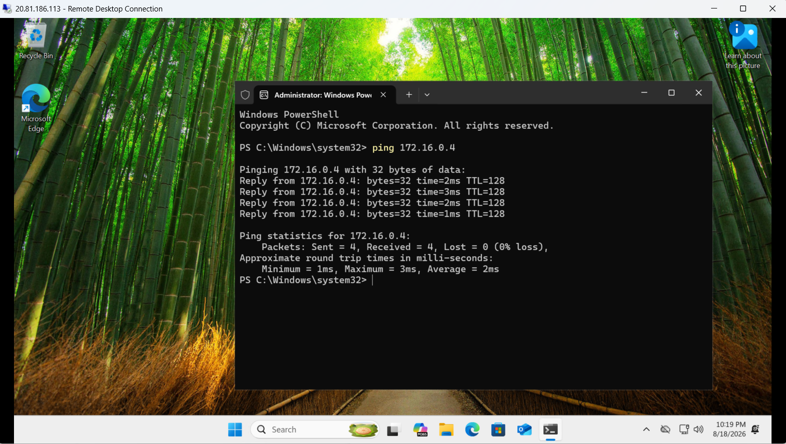

Running ipconfig /all afterward confirmed that client1's active DNS server was now listed as 172.16.0.4, matching DC1's static IP.

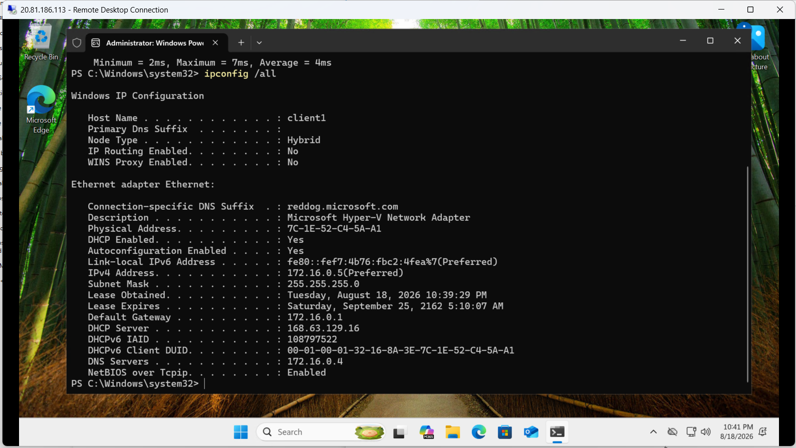

**Why both checks matter, and why they check different things:** the ping test only proves that client1 and DC1 can reach each other over the network at all. It does not prove the DNS setting actually took effect, since ping was run directly against an IP address and never touched name resolution. The ipconfig /all check is what actually confirms the DNS configuration itself landed correctly, by showing 172.16.0.4 as the DNS server client1 is now configured to query. Running both together separates two different questions that are easy to conflate: can the two machines talk to each other, and is client1 actually asking the right machine for DNS answers. Both have to be true before moving into the domain join itself.

---

## Build Phases

1. Created the Active-Directory-Lab resource group and vnet-eastus2-1 virtual network
2. Built DC1 (Windows Server 2022 Datacenter) inside that resource group and vnet
3. Built client1 (Windows 11 Pro) on the same vnet and subnet as DC1
4. Set DC1's private IP allocation from Dynamic to Static at 172.16.0.4
5. Pointed client1's DNS servers setting to DC1's static IP instead of the Azure-inherited default
6. Verified connectivity with a ping test and confirmed the DNS change with ipconfig /all

---

## Recap

By the end of this phase:

- A single resource group, Active-Directory-Lab, holds every resource in the lab
- DC1 and client1 both exist on the same virtual network and subnet, able to reach each other privately
- DC1's private IP, 172.16.0.4, is locked as static so it cannot change out from under the DNS configuration
- client1's DNS servers setting is set to Custom, pointing directly at DC1's static IP
- A ping test from client1 to DC1 succeeded with 0% packet loss
- ipconfig /all on client1 confirms 172.16.0.4 as its active DNS server

**Next step:** installing Active Directory Domain Services and the DNS Server role on DC1, promoting it to a domain controller, and joining client1 to the resulting domain.

---

# Phase 2: Active Directory Installation and Domain Structure

**Bridgeway Technology engagement, Ashgrove Clinic, continued**

With DC1 and client1 provisioned and DNS pointed correctly, this phase turns DC1 into an actual domain controller for Ashgrove Clinic, builds out the directory structure the clinic's staff will live in, creates the working administrative account Bridgeway uses to run the rest of the engagement, and joins the clinic's first workstation, client1, to the resulting domain.

---

## Why This Phase Exists

A domain controller is not just a server with a role installed on it. Installing Active Directory Domain Services (AD DS) only puts the software in place, the machine does not actually become the authority for a domain until it is promoted, a process that creates a new forest and root domain from scratch. Everything downstream of this phase, user accounts, group policy, workstation domain membership, depends on that promotion happening correctly first.

This phase also makes a naming decision that matters for the rest of the engagement. Rather than using a generic lab domain name, DC1 was promoted as the root of the **ashgroveclinic.com** forest, so that every account, computer object, and policy created from this point forward reads as belonging to the actual clinic, not a placeholder lab environment. This is also where Bridgeway stops relying on the default local administrator account and creates a dedicated domain admin identity to work from, mirroring how a real engagement separates "break glass" local credentials from day-to-day administrative access.

---

## What Got Configured

### 1. Installing Active Directory Domain Services on DC1

**Path:** Server Manager > Add roles and features

Before DC1 can become a domain controller, the underlying AD DS role has to be installed on the server, the same as any other Windows Server role.

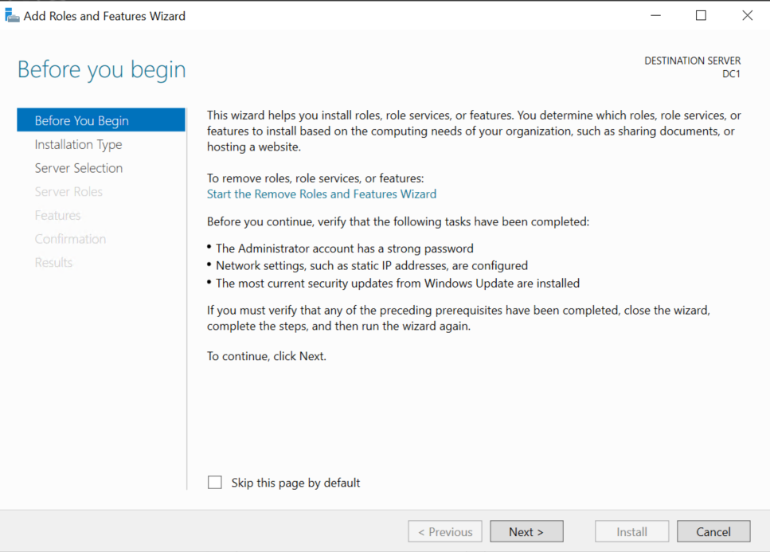

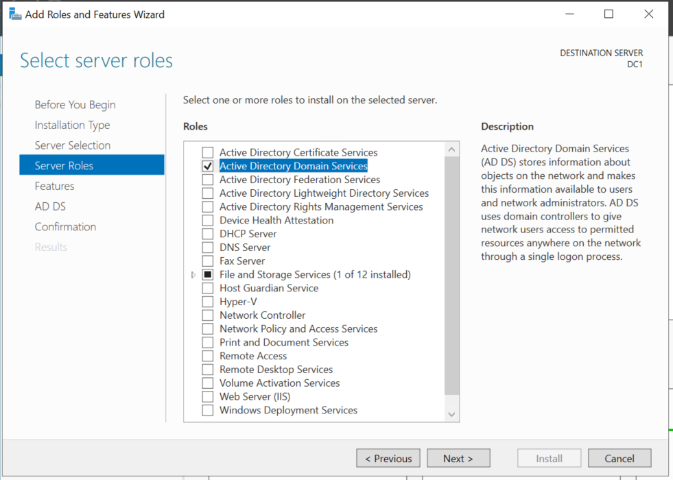

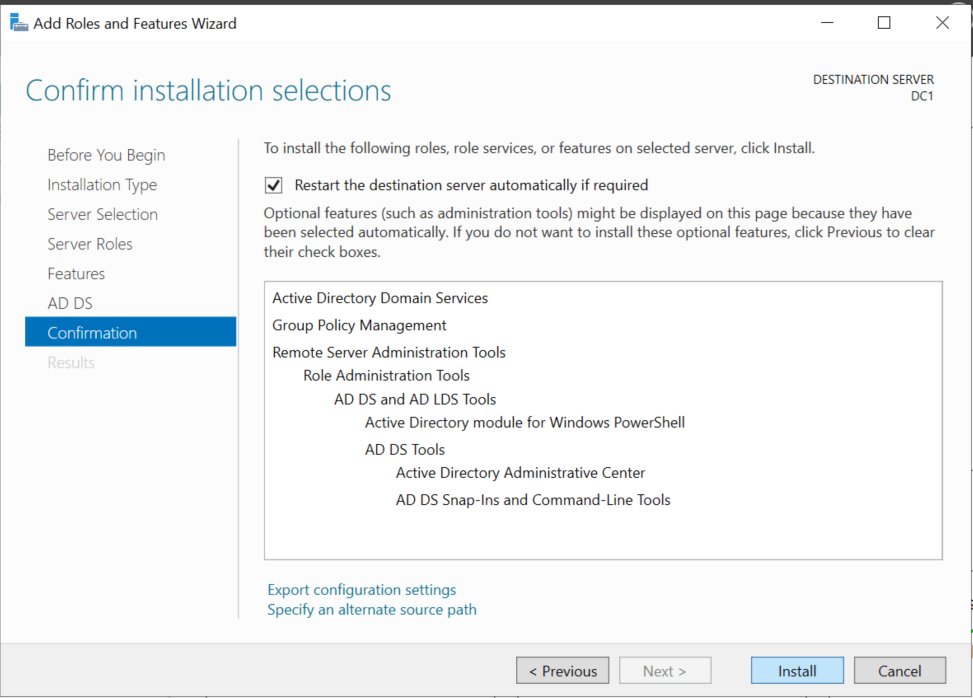

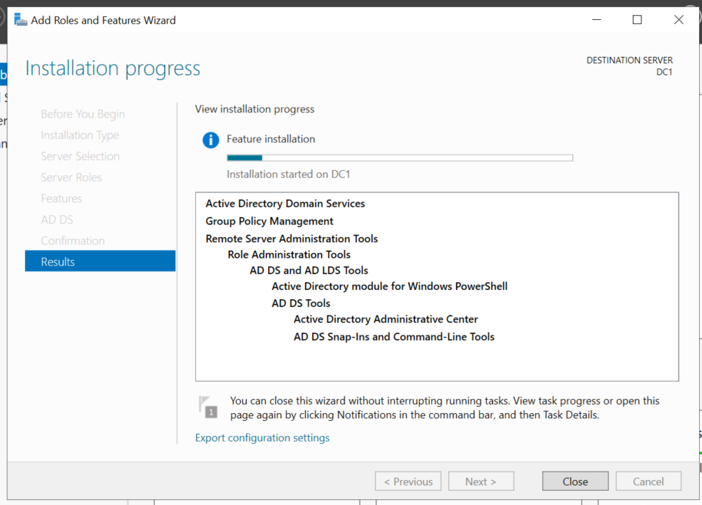

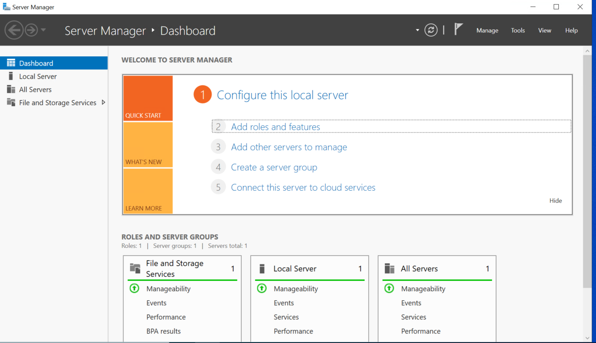

**Why this had to happen before anything else in this phase:** promotion to a domain controller is a separate step from installing the role, but it depends entirely on the role already being present. Trying to promote a server without AD DS installed simply is not possible, the option does not exist. This is also standard practice outside of a lab, installing the role is the low risk, easily reversible part; promotion is the step that actually changes what the server is.

### 2. Promoting DC1 to Ashgrove Clinic's Domain Controller

**Path:** Server Manager notification flag > Promote this server to a domain controller

Once the role finished installing, Server Manager flagged that post-deployment configuration was required.

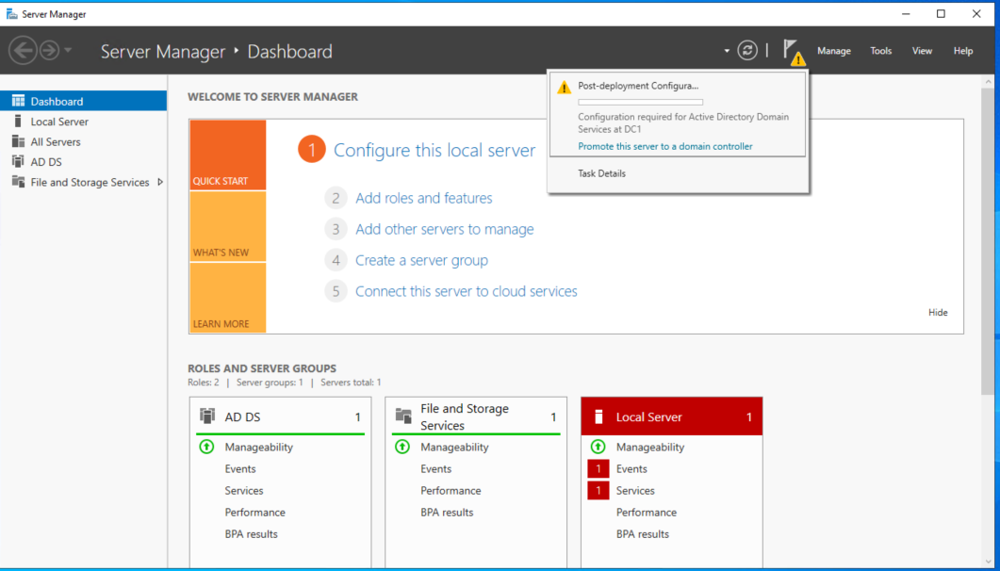

The promotion wizard was configured to add a brand new forest, rooted at **ashgroveclinic.com**, rather than joining an existing domain or forest, since this is the first and only domain controller in the environment.

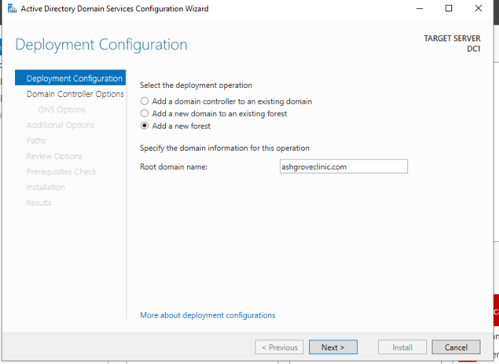

On the Domain Controller Options screen, DC1 was also configured to run the DNS Server role as part of promotion, and a Directory Services Restore Mode (DSRM) password was set.

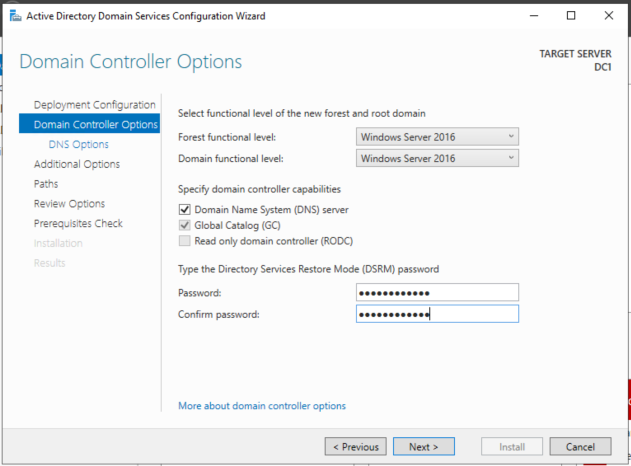

Before the actual installation ran, the wizard validated that all prerequisites for promotion had passed.

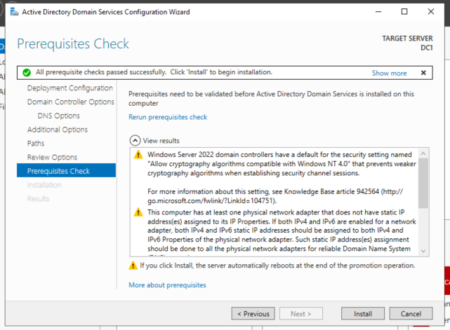

**Why ashgroveclinic.com instead of a generic lab domain name:** this decision was made specifically so the domain read as belonging to the actual fictional client rather than a training environment. A domain name is not something that can be casually renamed after the fact, it is baked into the forest root at creation, so this had to be decided correctly before clicking Install rather than fixed afterward.

**Why DC1 also runs DNS:** a domain controller advertises its own presence and services, like Kerberos and LDAP, through DNS records, specifically SRV records that get created automatically once AD DS is promoted and DNS is running on the same machine. Since client1's DNS setting was already pointed at DC1's static IP back in Phase 1, having DC1 also serve as the DNS server for the domain is what makes that earlier configuration actually pay off, DC1 is now both the domain controller and the authority that answers questions about where to find it.

**Acknowledging a homelab shortcut:** running DNS and Active Directory Domain Services on the same single server, with no redundancy and no second domain controller, would not be acceptable in a real production environment. A real clinic-scale deployment would run at least two domain controllers for fault tolerance, since losing the only domain controller means losing authentication, DNS, and directory services all at once. This lab intentionally runs a single DC to keep the environment simple and low cost, a tradeoff acceptable for learning purposes but not for an actual client rollout.

### 3. Logging Back Into DC1 With Domain Credentials

**Path:** Remote Desktop Connection

After promotion completed and DC1 restarted, logging back in required a domain qualified username rather than a local one, since the machine's identity had fundamentally changed.

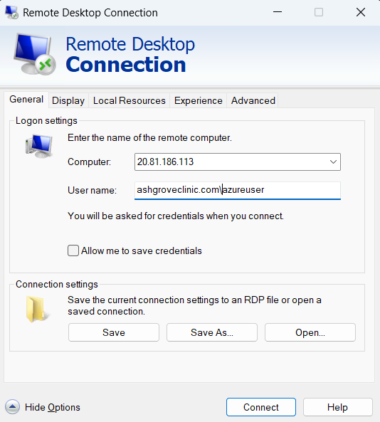

**Why the login context changes:** before promotion, DC1 only recognized local Windows accounts. After promotion, the machine's accounts exist inside the ashgroveclinic.com directory, so Windows needs to know which authority to check credentials against, the local machine or the domain. Specifying the domain explicitly in the login (ashgroveclinic.com\\username) is what tells Windows to check against Active Directory rather than a local account database.

### 4. Building the Organizational Unit Structure

**Path:** Active Directory Users and Computers > right click ashgroveclinic.com > New > Organizational Unit

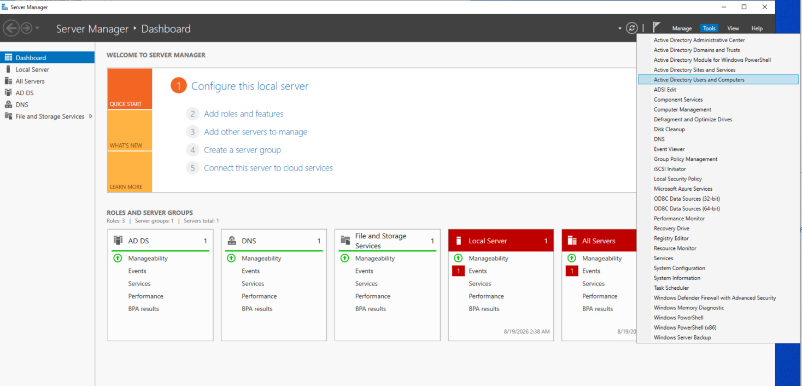

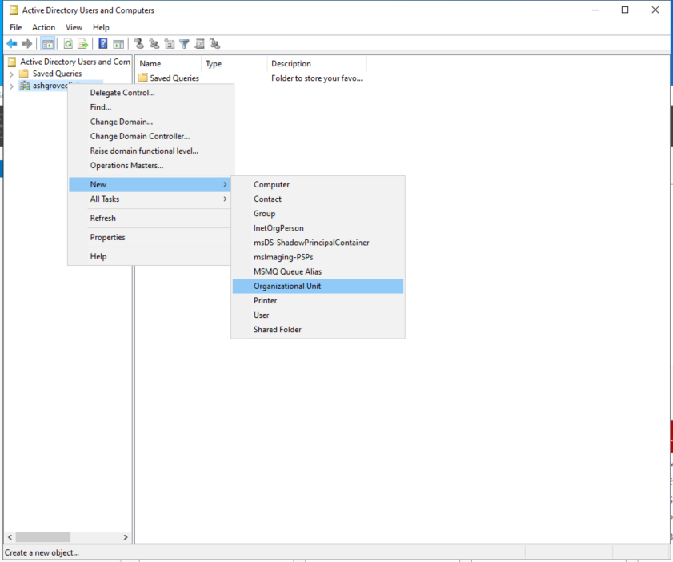

Rather than a flat structure, the directory was organized around Ashgrove Clinic's actual departments, with a separate, isolated OU reserved for privileged administrative accounts. The **_ADMINS** OU was created first.

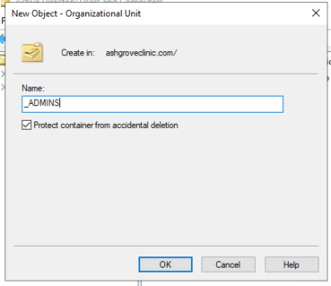

The same process was repeated to create **CLINICAL**, along with **_IT**, **_FRONT DESK**, **_FINANCE**, and **_CLIENTS**.

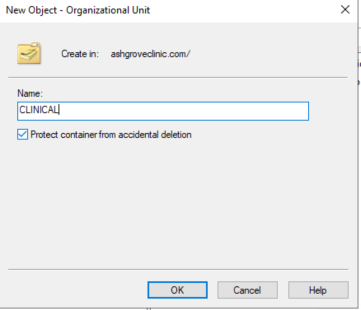

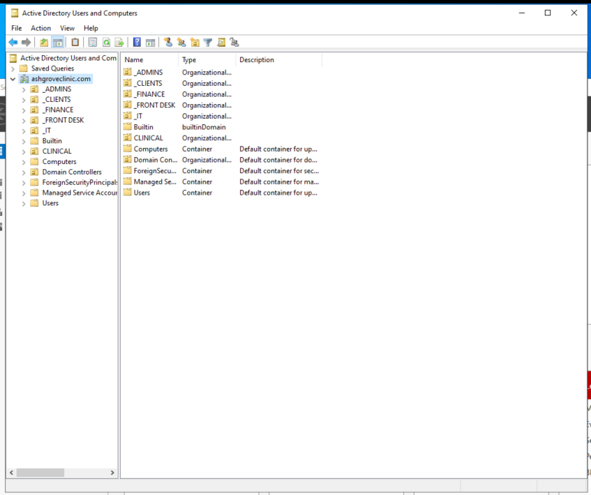

**Why department based OUs instead of a generic employees folder:** a flat employees OU tells you nothing about who someone is or what policies should apply to them. Structuring the directory around Ashgrove's real departments means that later phases, like Group Policy, can target specific groups of staff differently, tighter security settings for Finance, different software for Clinical versus Front Desk, without needing to reorganize the directory first. This is the kind of decision a real MSP makes on day one of an engagement, not something bolted on later.

**Why _ADMINS is kept separate from every department, including IT:** this is a deliberate security boundary, not just a naming preference. Privileged accounts, the ones with the ability to make domain wide changes, should never sit in the same container as standard user accounts, even accounts belonging to IT staff. This separation is what is known as tiered administration, isolating high privilege credentials so that a compromised standard account cannot easily be used to pivot into full domain control. Ashgrove's own IT staff, Devon Ricci and Marcus Bell, live in the **_IT** OU as standard users, not in **_ADMINS**, since day to day department work does not require domain admin rights.

**Note on naming convention:** the underscore prefix on _ADMINS, _IT, _FRONT DESK, and _FINANCE is a deliberate lab convention, not an Active Directory requirement. Prefixing an OU name with an underscore causes it to sort to the top of an alphabetically ordered list, making it easier to visually separate administrative or structural OUs from anything else in the directory at a glance. CLINICAL and _CLIENTS were named without perfect consistency here, a minor naming inconsistency that would be worth standardizing in a real production build, but is left as-is in this documentation to accurately reflect what was actually built.

### 5. Creating Bridgeway's Domain Admin Account

**Path:** right click _ADMINS OU > New > User

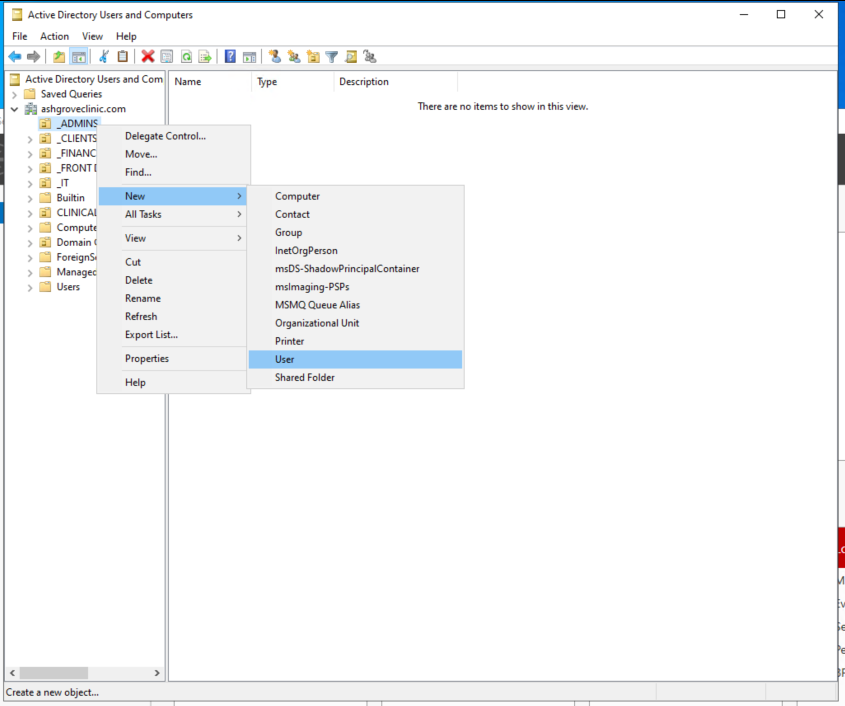

An account for Chibuike Okerulu, the Bridgeway technician running this engagement, was created with the logon name **chibuikeo**.

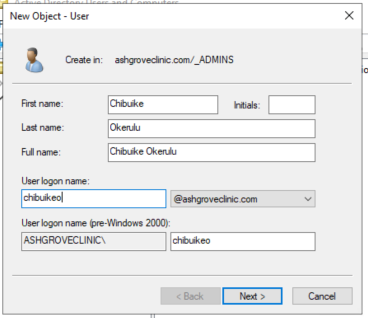

The account was then added to the built-in Domain Admins security group.

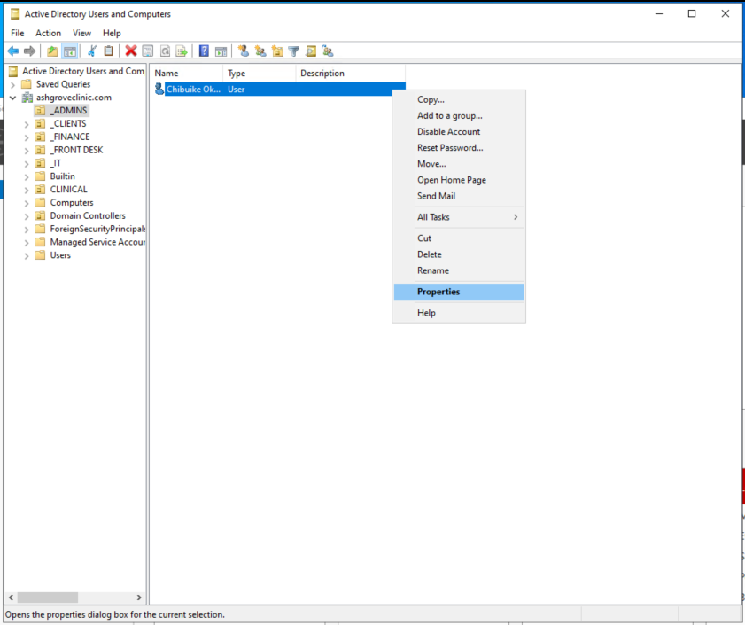

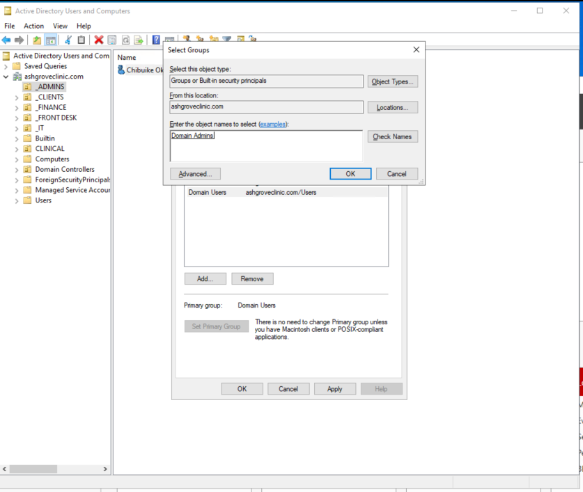

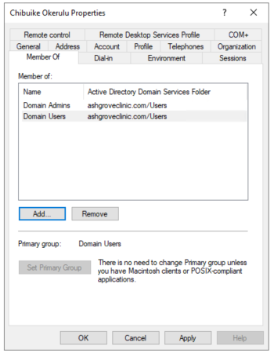

**Why creating an account is not the same as making it an admin:** placing a user inside the _ADMINS OU is purely organizational, it says nothing about what that account can actually do. What makes an account a domain admin is explicit membership in the built-in **Domain Admins** security group, a group whose members can make changes anywhere in the domain. This two step process, create the account, then explicitly grant the privilege, is intentional. It means privilege is never accidental, an account only has domain wide power because someone deliberately added it to that group.

From this point forward, **ashgroveclinic.com\\chibuikeo** is the account used for all administrative work on the domain, not the original local labuser or azureuser accounts.

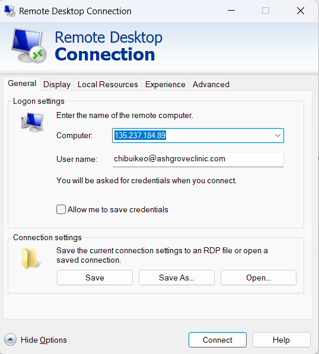

### 6. Joining client1 to the Domain

**Path:** client1 > Right click Start > System > Rename this PC (Advanced) > Change

Before the join, client1's System panel confirmed it was still a standalone machine, a local account (azureuser), and a member of the default WORKGROUP rather than any domain.

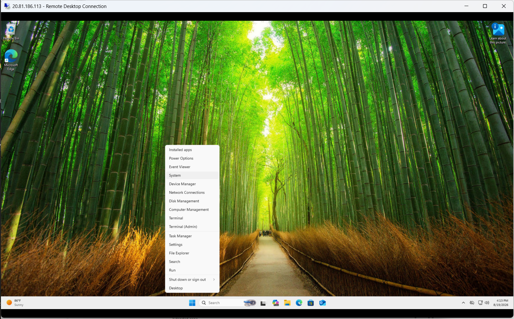

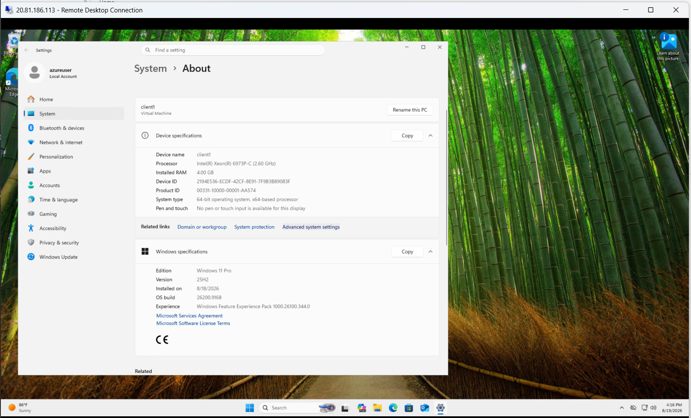

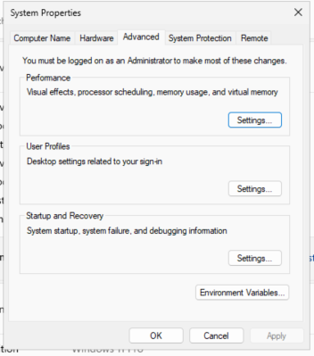

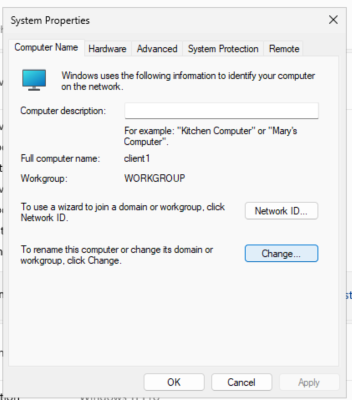

From the Computer Name/Domain Changes dialog, client1 was pointed at **ashgroveclinic.com**.

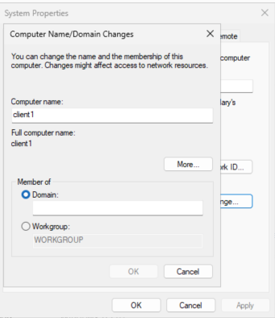

Because client1's DNS setting was already pointed at DC1 back in Phase 1, and DC1 is now authoritative for ashgroveclinic.com, the join was able to locate the domain controller and complete successfully.

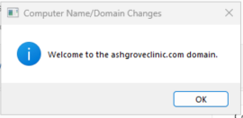

After the required restart, the Computer Name/Domain Changes dialog confirmed client1's new fully qualified name.

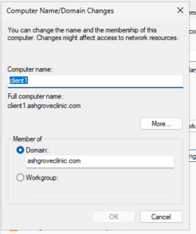

**Why this step only worked because of Phase 1's DNS configuration:** a domain join is fundamentally a DNS driven process. When client1 was told to join ashgroveclinic.com, it did not know DC1's address directly, it had to look up SRV records for that domain name to find the domain controller and its services. Had client1 still been using Azure's default DNS resolver instead of pointing at DC1, this step would have failed outright with an error stating the domain controller could not be located, since Azure's resolver has no knowledge of a private, self hosted domain like this one. This is the concrete payoff of the DNS reasoning laid out in Phase 1.

### 7. Verifying the Domain Join

**Path:** DC1 > Active Directory Users and Computers > Computers

Back on DC1, client1's computer object was confirmed inside the default Computers container, with its DNS name showing as fully qualified.

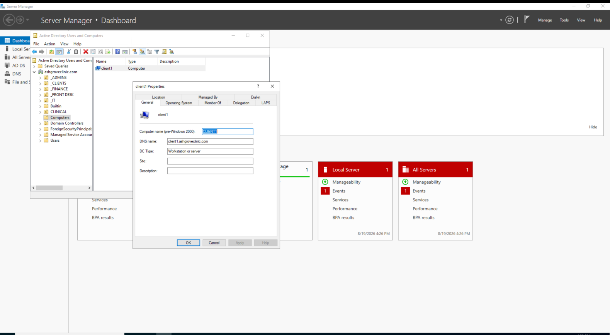

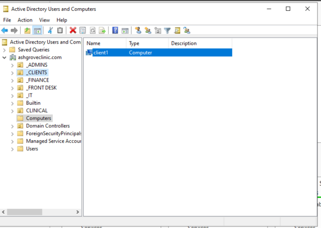

After the restart, logging back into client1 confirmed the domain login worked end to end.

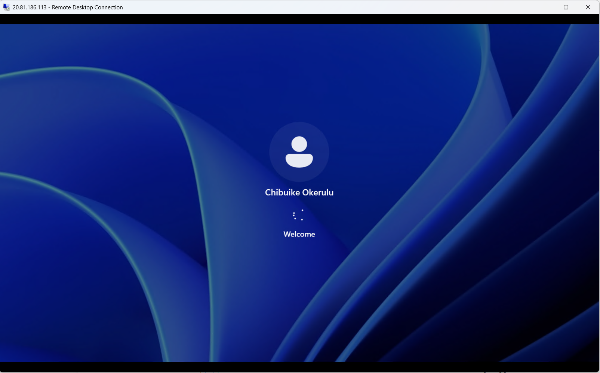

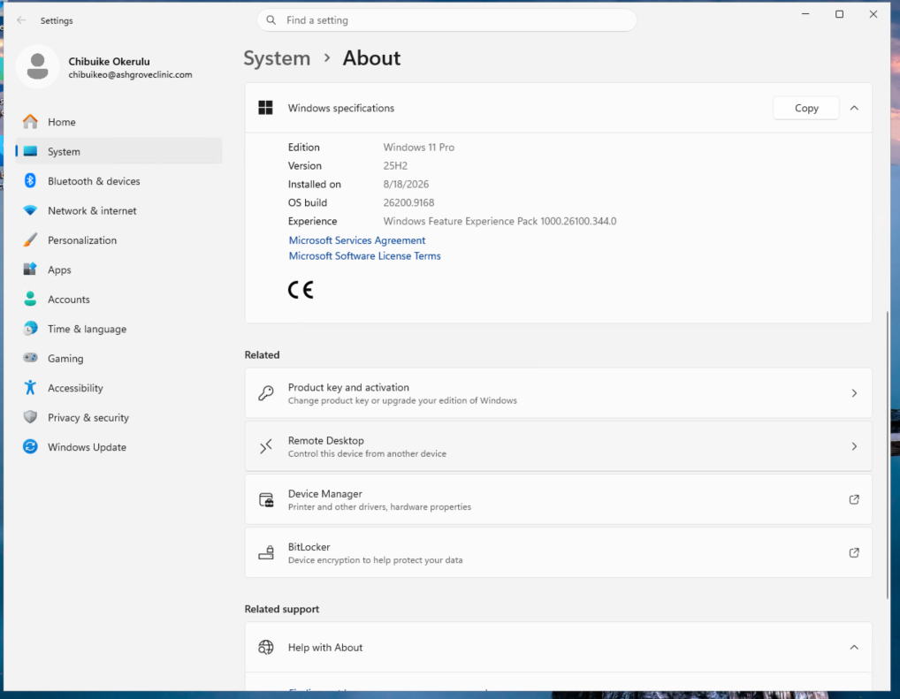

**Why client1 lands in the default Computers container instead of the _CLIENTS OU automatically:** when a machine joins a domain, Windows places its computer object into the default Computers container unless a specific target OU is specified as part of the join command. Moving it into a purpose built OU like _CLIENTS is a manual step that has to happen afterward, it does not happen automatically just because a _CLIENTS OU exists. This is a common point of confusion, and worth noting explicitly here since it is easy to assume otherwise.

---

## Build Phases

1. Installed the Active Directory Domain Services role on DC1
2. Promoted DC1 to the domain controller for a new forest, ashgroveclinic.com, with the DNS Server role enabled
3. Logged back into DC1 using domain qualified credentials
4. Built the department based OU structure: _ADMINS, _IT, CLINICAL, _FRONT DESK, _FINANCE, and _CLIENTS
5. Created Bridgeway's working domain admin account, chibuikeo, and added it to Domain Admins
6. Joined client1 to ashgroveclinic.com, relying on the DNS configuration from Phase 1
7. Verified the join in Active Directory Users and Computers and confirmed a successful domain login on client1

---

## Recap

By the end of this phase:

- DC1 is a functioning domain controller for the ashgroveclinic.com forest, also running DNS for that domain
- The directory is organized around Ashgrove Clinic's real departments, with a dedicated, isolated OU for privileged accounts
- A working domain admin account, chibuikeo, exists and is used for all further administrative work in this engagement
- client1 is joined to ashgroveclinic.com and can be logged into with domain credentials
- client1's computer object is confirmed present in Active Directory, still sitting in the default Computers container pending a manual move to _CLIENTS

**Next step:** enabling non-admin domain users to remotely access client1, then bulk-provisioning Ashgrove Clinic's staff accounts across the department OUs.

---

# Phase 3: Remote Access for Staff and Bulk Account Provisioning

**Bridgeway Technology engagement, Ashgrove Clinic, continued**

With ashgroveclinic.com's domain controller live and client1 joined, this phase opens client1 up so Ashgrove's regular staff, not just domain admins, can actually log into it, then bulk-provisions the clinic's staff accounts using a PowerShell script. The five named cast members from the engagement are seeded into their correct departments, alongside a batch of additional staff with real, generated names distributed across the remaining department OUs.

---

## Why This Phase Exists

A domain-joined workstation is not automatically usable by the people it is meant for. By default, only local administrators can remotely access a Windows machine, which means Ashgrove's actual staff, people like Devon Ricci or Tasha Combs, would be locked out of client1 even though their accounts exist in the directory. This phase closes that gap.

It also solves a scaling problem. Creating twenty user accounts by hand, one at a time through the Active Directory Users and Computers GUI, is slow and error prone. A PowerShell script automates that work, and doing it this way also mirrors a real pattern in IT operations, provisioning tools that handle bulk account creation consistently rather than relying on manual, repetitive GUI work for every new hire.

---

## What Got Configured

### 1. Allowing Non-Admin Domain Users to Access client1 Remotely

**Path:** client1 > Settings > System > Remote Desktop > Remote Desktop users

By default, Remote Desktop access was limited to administrators. The **Domain Users** group, which every standard domain account belongs to automatically, was added to the list of users permitted to connect.

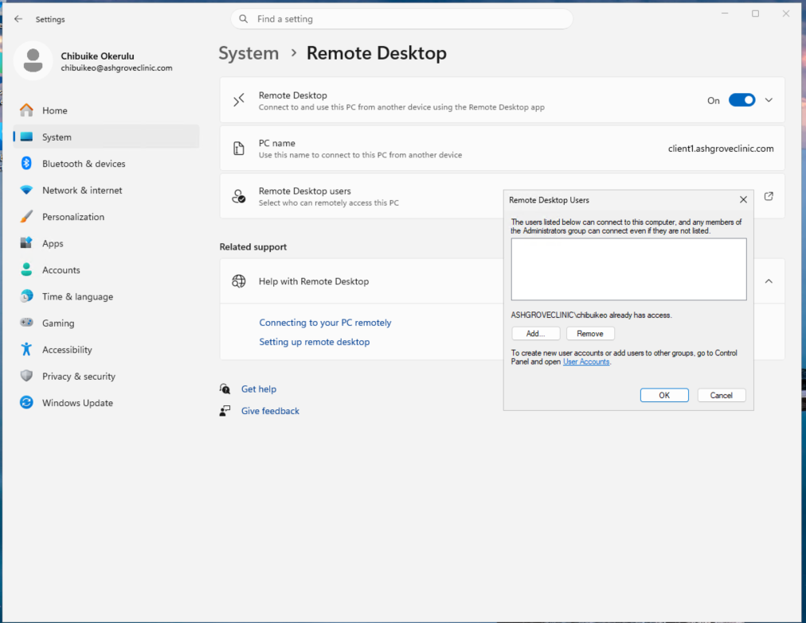

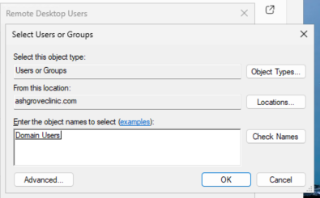

**Why this matters:** without this change, every staff account created later in this phase would exist in Active Directory but be functionally useless, unable to log into the one workstation they need to do their job. Adding Domain Users rather than individual named accounts means any current or future Ashgrove staff account can use client1 without needing this setting touched again.

**Acknowledging a homelab shortcut:** this setting was configured manually, directly on client1, because there is currently only one clinic workstation in the environment. In a real deployment with multiple machines, this same setting would be pushed out through a Group Policy Object linked to the workstation OU, so every domain-joined machine inherits it automatically instead of being configured one at a time. Doing it by hand here is a reasonable shortcut for a single-machine lab, but it would not scale to a real clinic with more than a handful of workstations, and is flagged here as a manual step, not the production pattern.

### 2. Writing and Correcting the Bulk User Creation Script

**Path:** DC1 > PowerShell ISE (Run as Administrator)

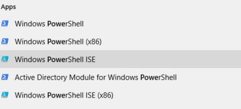

A script, create-users.ps1, was written to create the five named Ashgrove Clinic staff members directly into their correct department OUs, followed by a batch of additional staff with real generated names, randomly distributed across the department OUs.

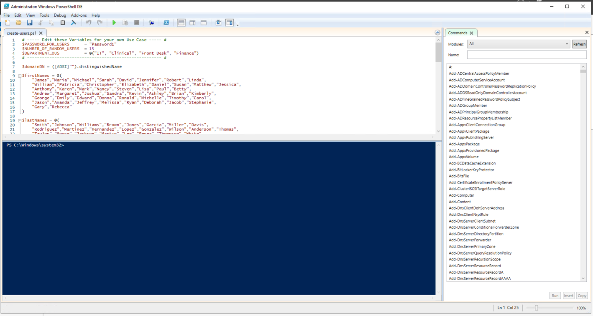

The script went through several corrections before landing on a working version, each one worth documenting since they reflect real debugging, not a clean first attempt:

- The original reference script this was based on generated names algorithmically from consonant and vowel patterns, producing unrealistic strings rather than plausible staff names. This was replaced with two arrays of fifty real first and last names each, so generated accounts read as actual people rather than random character strings.
- The original script also contained a genuine bug, a variable named `$fisrtName` was assigned, but `$firstName` was the name actually referenced later in the script, meaning every generated user's first name field was silently left blank. This was corrected so names populate properly.
- The script's target OU was originally hardcoded to a generic `_EMPLOYEES` OU, which does not exist in Ashgrove Clinic's directory structure. This was changed to target the four real department OUs, `_IT`, `CLINICAL`, `_FRONT DESK`, and `_FINANCE`, matching exactly what exists under ashgroveclinic.com, since Active Directory OU references have to match the existing name exactly or the account creation for that user fails outright.
- A duplicate check was added so the script can be safely re-run without throwing an error on any account that already exists.
- Each account creation was wrapped in a try/catch block so that if one user fails to create for any reason, the script reports the specific error and continues to the next user instead of the entire run stopping.

The corrected script is provided as a separate file, **create-users.ps1**, alongside this documentation.

### 3. Running the Script and Reviewing the Output

**Path:** PowerShell ISE > Run Script

The script was executed directly in PowerShell ISE.

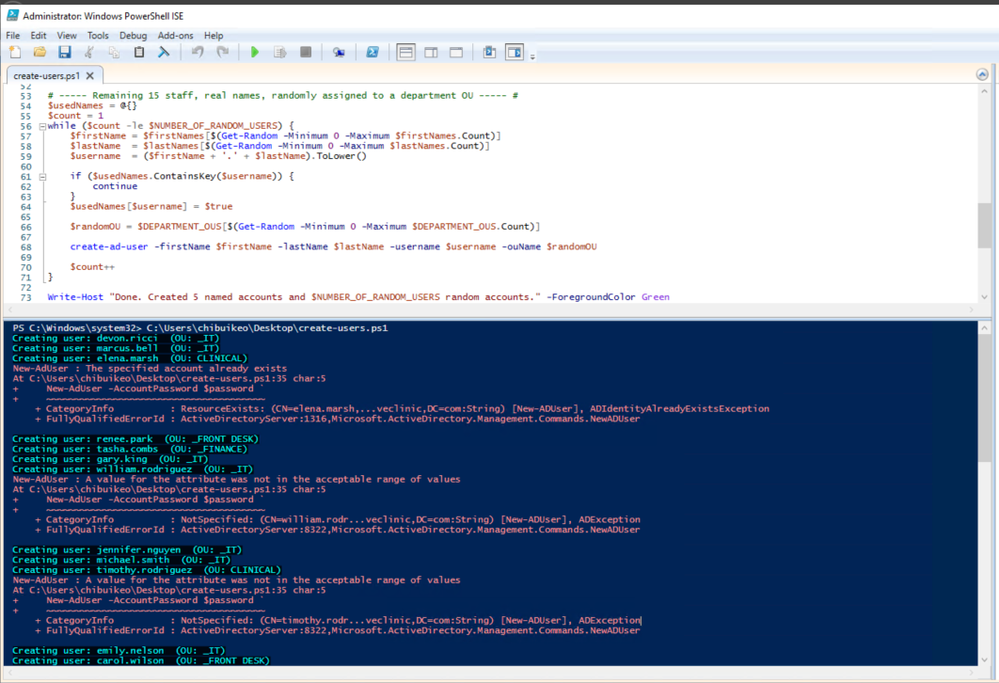

The console output showed the five named accounts creating successfully, followed by errors on two of the generated accounts.

**What the errors actually meant, since the messages themselves were not self explanatory:**

- **elena.marsh — `ADIdentityAlreadyExistsException`:** this is a clear, specific error. It means an account with that exact username already existed in Active Directory at the moment the script tried to create it again, most likely left over from an earlier partial run of the script during testing. This is precisely the failure mode the duplicate check addition was meant to prevent on future runs.
- **william.rodriguez and timothy.rodriguez — "a value for the attribute was not in the acceptable range of values":** this error is deliberately vague, Active Directory's own exception here (`ADException`, category `NotSpecified`) does not name which attribute actually failed. The most likely explanation is that the automatically derived SamAccountName or a related identity attribute ran into a naming constraint or collision that a generic error message did not surface clearly. Since the original script never explicitly set a SamAccountName and instead let Active Directory derive one automatically from the full Name field, this kind of unclear failure is a known pattern in that situation. The corrected script sets SamAccountName explicitly, trimmed to Active Directory's 20 character limit, which removes this specific failure mode going forward.

**Why documenting the errors matters, not just the fix:** in a real environment, a help desk technician or sysadmin will run into exactly this kind of unclear error message regularly. Being able to reason through what a vague Active Directory exception actually points to, rather than just re-running a script and hoping it works the second time, is a real, transferable troubleshooting skill, and is worth capturing here rather than glossing over.

### 4. Verifying the Accounts Landed in the Correct Departments

**Path:** DC1 > Active Directory Users and Computers

Each department OU was checked to confirm the named cast members and the generated staff landed where expected.

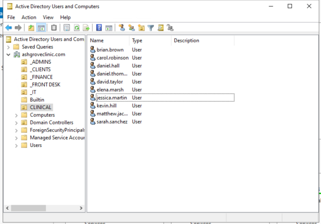

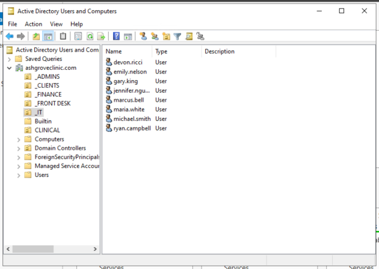

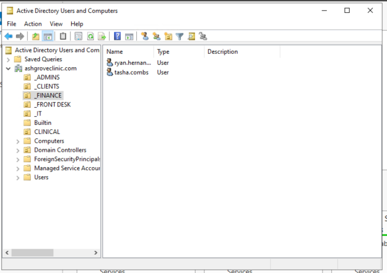

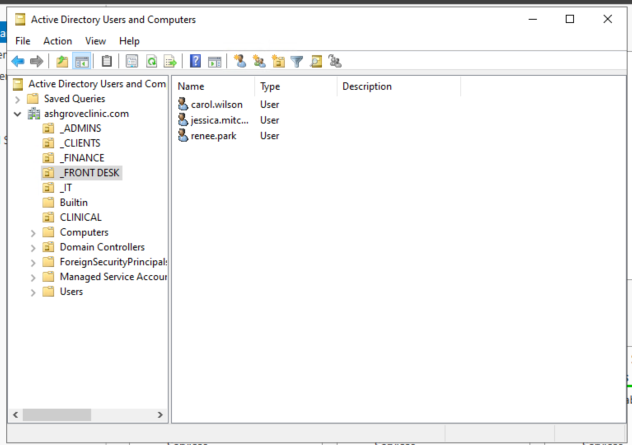

**Why the department counts came out uneven:** the fifteen additional generated accounts were randomly assigned to one of the four department OUs each, with no attempt to balance the count evenly across departments. This mirrors reality more closely than a perfectly even split would, real clinics do not staff every department with the exact same headcount, and an uneven, organic looking distribution is more representative of an actual organization than a mechanically even one.

### 5. Testing a Non-Admin Domain Login

**Path:** client1 (via Remote Desktop)

With the Remote Desktop Users setting now allowing Domain Users, a login was tested using one of the named staff accounts rather than the domain admin account.

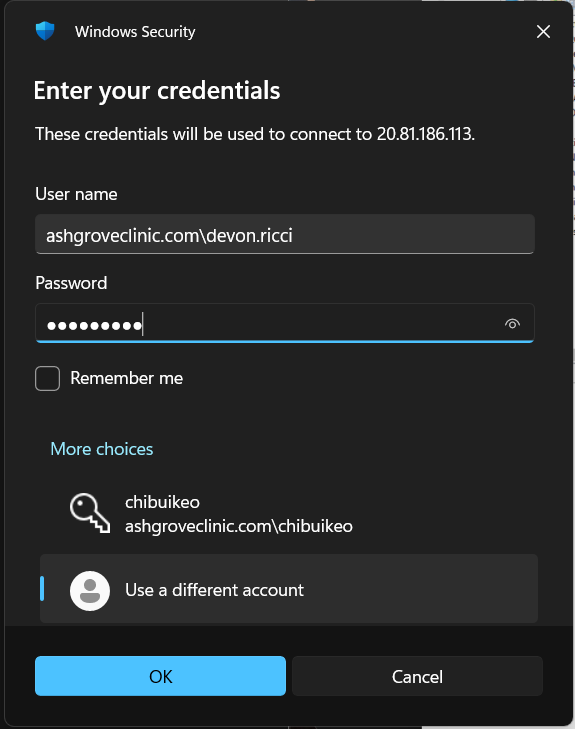

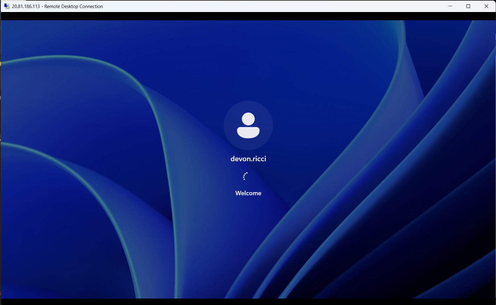

Once logged in, a local user profile was confirmed to have been created for the account, alongside profiles from previous logins.

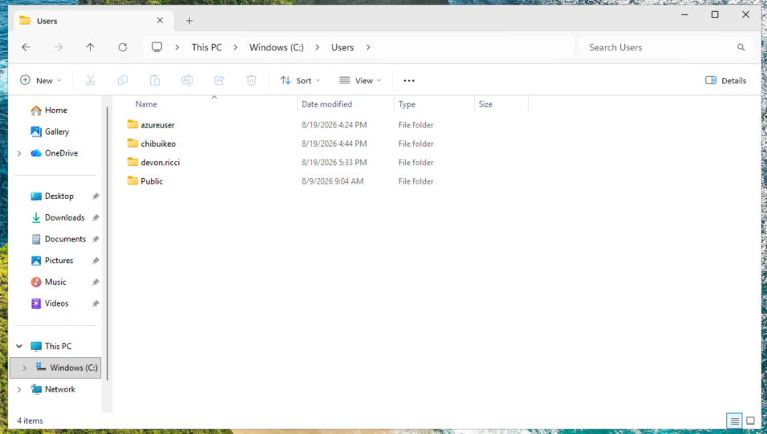

**Why a new local profile appears the first time a domain user logs in:** a domain account is not automatically tied to a local user profile on every machine it might log into. The first time any domain account logs into a specific workstation, Windows creates a fresh local profile folder for that account on that machine, which is why this first login typically takes noticeably longer than subsequent ones, Windows is provisioning the profile, not just authenticating.

---

## Build Phases

1. Enabled Remote Desktop access for the Domain Users group on client1, so any Ashgrove Clinic staff account can log in remotely, not just domain admins
2. Wrote and debugged create-users.ps1, correcting a blank-first-name bug, replacing algorithmic name generation with real names, retargeting the OU references to match the actual department OUs, adding a duplicate-account check, and wrapping account creation in error handling
3. Ran the script, creating the five named Ashgrove Clinic staff members plus fifteen additional randomly-named staff, diagnosing and explaining the two error types that occurred during the run
4. Verified the resulting accounts landed in the correct department OUs
5. Tested and confirmed a successful non-admin domain login on client1 using one of the named staff accounts

---

## Recap

By the end of this phase:

- client1 accepts Remote Desktop logins from any standard Ashgrove Clinic domain account, not just admins
- Twenty Ashgrove Clinic staff accounts exist across the _IT, CLINICAL, _FRONT DESK, and _FINANCE OUs, including the five named cast members (Devon Ricci, Marcus Bell, Elena Marsh, Renee Park, Tasha Combs) in their correct departments
- The account creation script (create-users.ps1) is corrected, documented, and provided as a standalone, reusable file
- A non-admin staff login was tested and verified successfully on client1, confirming both the department OU structure and the Remote Desktop access change are working as intended

**Next step:** configuring an account lockout policy for the domain, then walking through account lockouts, password resets, enabling and disabling accounts, and reviewing authentication logs, the day-to-day account administration work of a help desk technician.

---

# Phase 4: Account Lockout Policy, Password Administration, and Log Review

**Bridgeway Technology engagement, Ashgrove Clinic, final phase**

With Ashgrove Clinic's directory, departments, and staff accounts all in place, this phase covers the account administration work a help desk technician deals with constantly: lockouts, password resets, enabling and disabling accounts, and reviewing authentication logs. This phase also uncovered and fixed a real gap, Ashgrove Clinic's domain had no account lockout policy configured, meaning failed login attempts were not being limited at all until Bridgeway corrected it.

---

## Why This Phase Exists

Account lockout policy exists for one reason: to stop someone, whether a distracted employee or an actual attacker, from guessing a password an unlimited number of times. Without a threshold in place, a compromised or weak password becomes a matter of when, not if, since automated tools can attempt thousands of password guesses without ever being stopped. A help desk technician also deals with the operational side of this constantly, unlocking legitimate users who mistyped their password one too many times, resetting forgotten passwords, and reviewing logs to understand what actually happened during a lockout or a suspicious login attempt.

This phase walks through discovering that gap by testing it directly, fixing it with Group Policy, and then verifying the fix actually works end to end.

---

## What Got Configured

### 1. Discovering the Missing Lockout Policy

**Path:** client1 (via Remote Desktop), attempting repeated failed logins

Before configuring anything, a test account was deliberately logged into with an incorrect password, repeated ten to eleven times in a row, to see whether Ashgrove Clinic's domain would lock the account out on its own.

**Result:** the account did not lock out at all. This was not the expected outcome and revealed that Ashgrove Clinic's domain, like a freshly created Active Directory forest generally, had no account lockout threshold configured out of the box. This is a real and important finding, not a scripted part of the lab, discovering it by testing directly is exactly how this kind of gap gets found in a real environment too.

**Acknowledging a homelab step that would look different in a real environment:** deliberately failing a login ten or more times in a row against a live account, even a test one, is not something that should be done against a real user's account in production without a clear, controlled purpose. Here it served a legitimate diagnostic purpose, confirming whether the policy existed before configuring it, but in a real clinic environment this kind of testing would typically be done against a dedicated test account created specifically for validating security controls, not a real staff member's credentials.

### 2. Configuring the Account Lockout Policy via Group Policy

**Path:** DC1 > Group Policy Management (gpmc.msc)

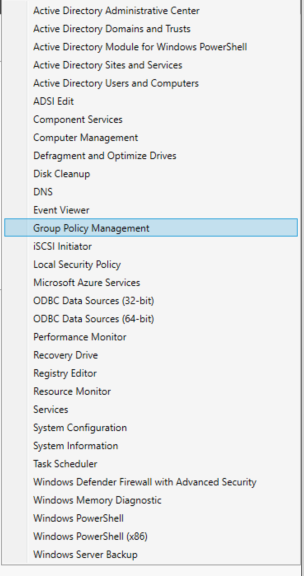

The **Default Domain Policy**, already linked to ashgroveclinic.com by default, was opened for editing rather than creating a new, separate policy.

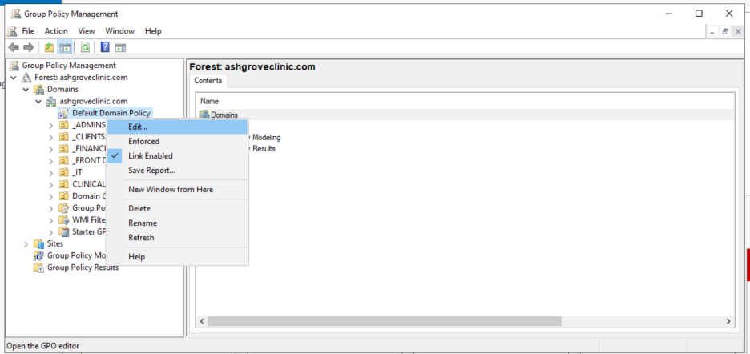

Inside the Group Policy Management Editor, the Account Lockout Policy node was located under Computer Configuration > Policies > Windows Settings > Security Settings > Account Policies.

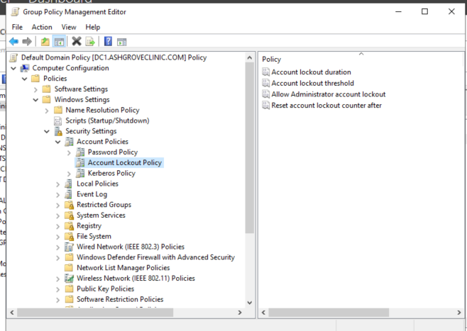

The lockout duration was set to 30 minutes.

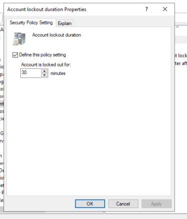

The remaining settings were configured alongside it: a lockout threshold of 5 invalid logon attempts, and a 10 minute reset window for the failed attempt counter.

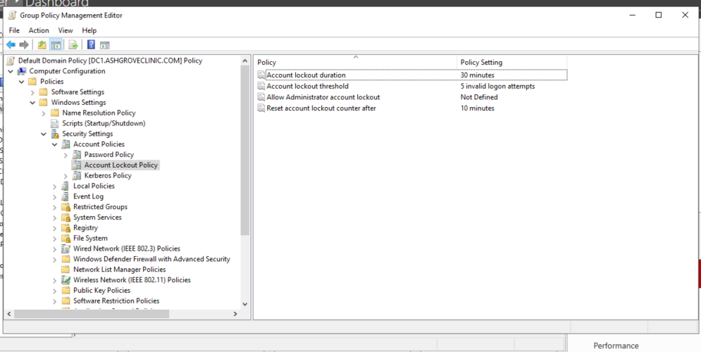

**Why editing the Default Domain Policy instead of creating a new GPO:** account lockout policy in Active Directory has a specific quirk, it can only be reliably enforced domain-wide through the Default Domain Policy, unlike most other settings which can be scoped to specific OUs through separate, linked GPOs. Creating a new policy linked elsewhere would not have reliably applied the lockout threshold across the domain.

**Why these specific values were chosen:** a threshold of 5 attempts gives a legitimate user a reasonable number of genuine mistakes, like a mistyped password, before being locked out, while still being low enough to meaningfully slow down anyone attempting to guess a password. The 30 minute lockout duration and 10 minute reset window balance security against convenience, long enough to make repeated automated guessing impractical, short enough that a legitimate user is not locked out for an excessive stretch of time without any path back in beyond waiting.

### 3. Forcing the Policy Onto client1

**Path:** client1 > Command Prompt

Rather than waiting for Group Policy's normal refresh cycle, which can take up to 90 minutes by default, the policy was forced onto client1 immediately.

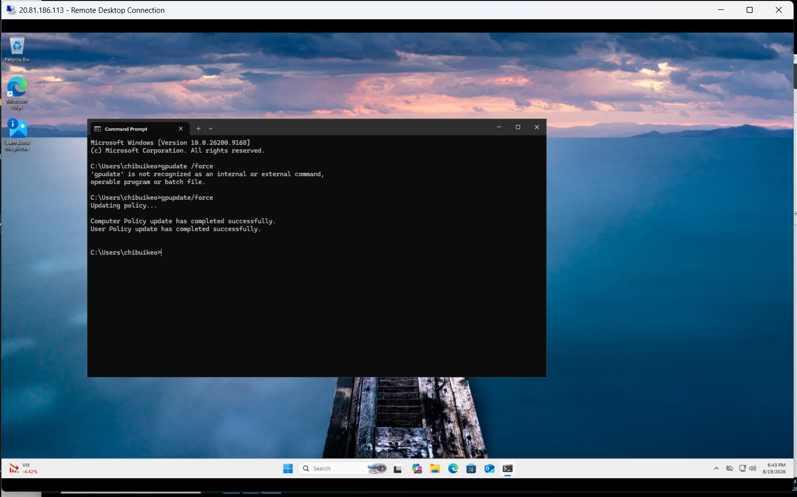

**Why forcing the update mattered here:** in a real environment, waiting for the normal refresh cycle is often perfectly acceptable, since policy changes are rarely this time sensitive. In this lab, forcing the update let the new lockout policy be verified immediately in the same session rather than requiring a return visit after waiting out the refresh window, a reasonable shortcut for testing purposes.

### 4. Verifying the Lockout Policy Actually Works

**Path:** client1, attempting repeated failed logins against the same test account

With the policy now active, the same test used in Step 1 was repeated, deliberately entering the wrong password five to seven times against the same account.

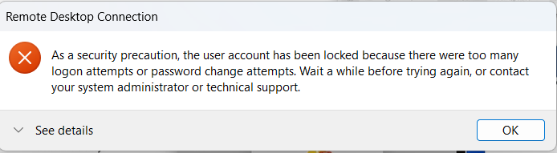

This time, the account locked out exactly as expected after the fifth failed attempt, confirming the policy was live and enforced.

### 5. Unlocking the Account

**Path:** DC1 > Active Directory Users and Computers > right click the account > Properties > Account tab

The locked account was located and its Account tab confirmed the lockout state directly.

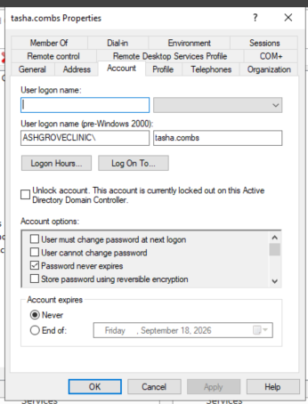

Checking the box and applying the change cleared the lockout.

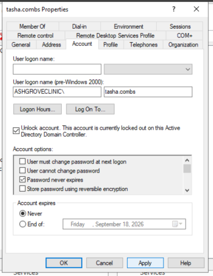

A subsequent login attempt with the correct password confirmed the account was accessible again.

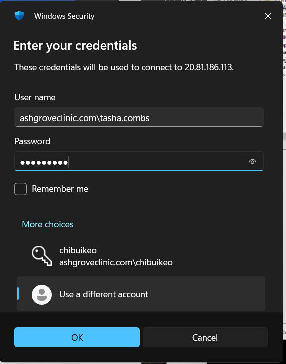

**Why unlocking is a separate action from resetting the password:** a lockout and a forgotten password are two different problems that happen to often occur together in practice. Unlocking simply clears the failed-attempt counter and lets the existing password work again, it does not change the password itself. This distinction matters operationally, a locked-out user who still remembers their correct password only needs an unlock, not a reset, and treating every lockout call as a password reset is unnecessary extra work.

### 6. Resetting a User's Password

**Path:** Active Directory Users and Computers > right click the account > Reset Password

A password reset was also demonstrated as a related but distinct administrative action, right clicking a user account and choosing Reset Password brings up a dialog to set a new password directly, with the option to simultaneously unlock the account in the same step if both apply.

**Acknowledging a homelab shortcut:** in this lab, every account, including the reset password shown here, uses a simple, shared, non-expiring password for convenience (Password1). In a real clinic environment, a password reset would generate a unique temporary password, typically require the user to change it on next login, and would never leave "password never expires" enabled indefinitely on a real staff account, since that setting removes a basic security control over time. These lab settings exist purely to keep the environment simple to work with while learning, not as a reflection of real password policy.

### 7. Disabling and Re-Enabling an Account

**Path:** Active Directory Users and Computers > right click the account > Disable Account

To simulate a staff departure or a suspected credential compromise, tasha.combs' account was disabled directly.

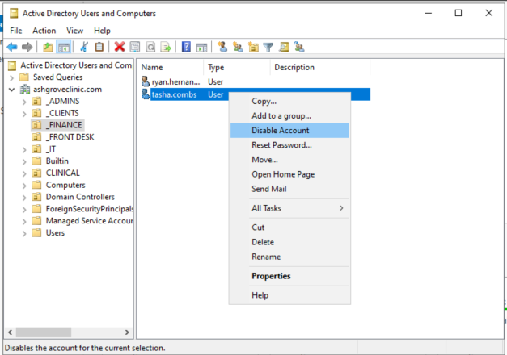

A subsequent login attempt confirmed the account was rejected specifically because it was disabled, a distinct error message from a lockout.

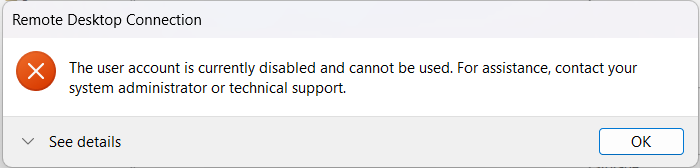

Re-enabling the account follows the identical process in reverse, right clicking the account and selecting Enable Account restores access immediately.

**Why disabling rather than deleting an account matters in a real environment:** deleting an account destroys its history, group memberships, and security identifier permanently, which is rarely what is actually needed when a staff member leaves or an account needs to be locked down quickly. Disabling preserves everything about the account while immediately cutting off access, giving Bridgeway (or Ashgrove's own IT staff) time to make a considered decision about whether the account should eventually be deleted, reassigned, or reactivated, rather than making an irreversible choice under time pressure.

### 8. Reviewing Authentication Logs

**Path:** client1 > Event Viewer (eventvwr.msc) > Windows Logs > Security

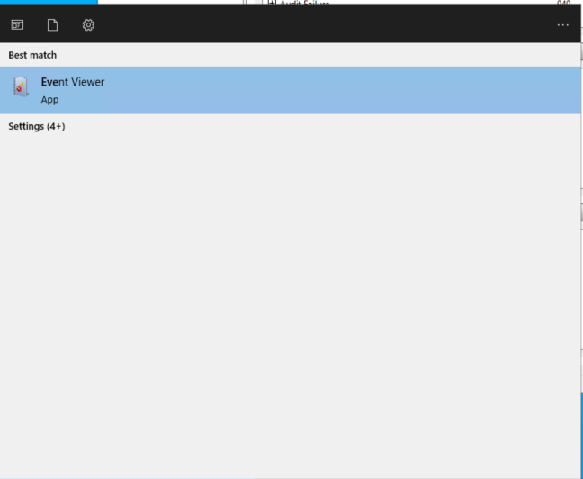

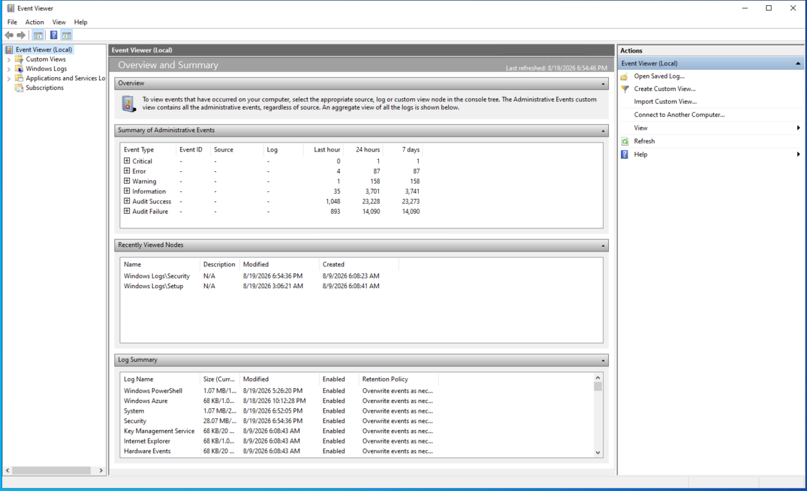

The Security log's Audit Failure and Audit Success counts confirmed that both the earlier failed login attempts and the eventual successful login after unlocking were captured as discrete, timestamped events.

**Why authentication events show up on client1, not DC1:** an authentication attempt is logged locally on whichever machine the login was actually attempted against. Since every login attempt in this phase was made directly against client1, that is where the corresponding Security log events live, specifically Event ID 4625 for a failed logon and Event ID 4624 for a successful one. DC1's own Security log reflects domain-level activity instead, like Kerberos ticket requests and logoff events. Knowing which machine to check for which type of event is a genuinely practical skill, not a formality, since checking the wrong machine during a real incident wastes time that may matter.

---

## Build Phases

1. Tested for an account lockout policy by deliberately failing a login repeatedly, and confirmed Ashgrove Clinic's domain had none configured by default
2. Configured the Default Domain Policy's Account Lockout Policy: 5 attempt threshold, 30 minute lockout duration, 10 minute reset counter
3. Forced the policy onto client1 with gpupdate /force rather than waiting for the normal refresh cycle
4. Re-tested the same failed-login scenario and confirmed the account locked out correctly after 5 attempts
5. Unlocked the account through its Account Properties tab and confirmed login access was restored
6. Demonstrated a password reset as a distinct action from an unlock
7. Disabled and walked through re-enabling an account to simulate a staff departure or compromised credential scenario
8. Reviewed Security log events on client1 to confirm both failed and successful login attempts were captured and timestamped

---

## Recap

By the end of this phase:

- Ashgrove Clinic's domain enforces an account lockout policy (5 attempts, 30 minute lockout, 10 minute reset window), tested and confirmed working end to end
- Documented, repeatable procedures exist for unlocking accounts, resetting passwords, and disabling or re-enabling accounts
- Authentication events for both failed and successful logins were located and reviewed in the Security log on client1, with an explanation of why that log, specifically, is where those events appear
- This closes out the Active Directory portion of the Ashgrove Clinic engagement. The domain, department structure, staff accounts, and core account security policy are all in place and verified working

This is the final phase of the Active Directory Lab series. DC1 and client1 remain required infrastructure for future phases of the Ashgrove Clinic engagement, including DNS practice and file permissions work, so both VMs should be stopped, not deleted, between sessions.

---

*Bridgeway Technology, Ashgrove Clinic engagement*
